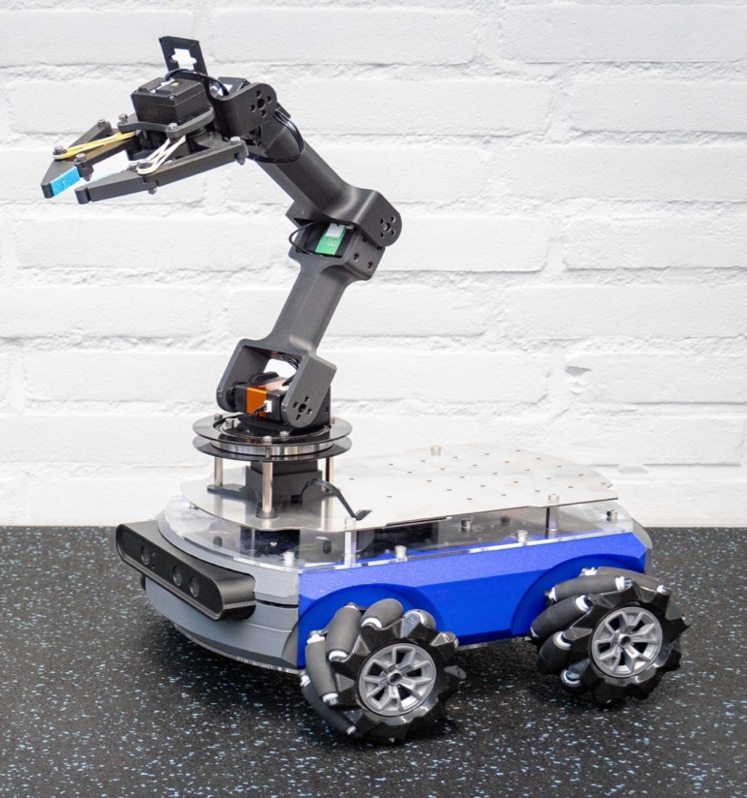
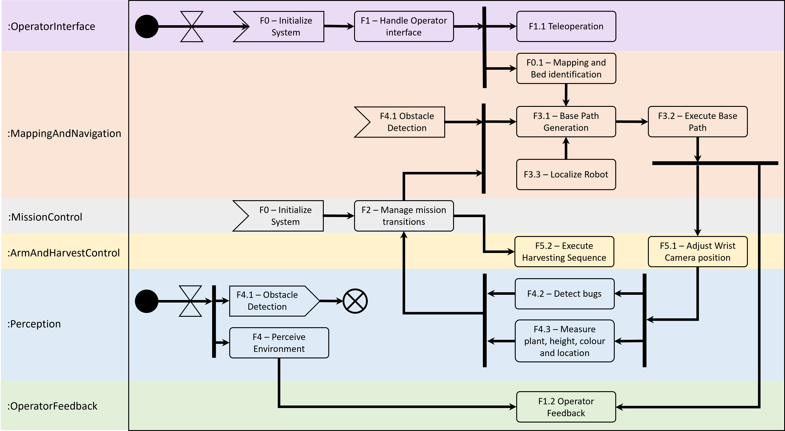
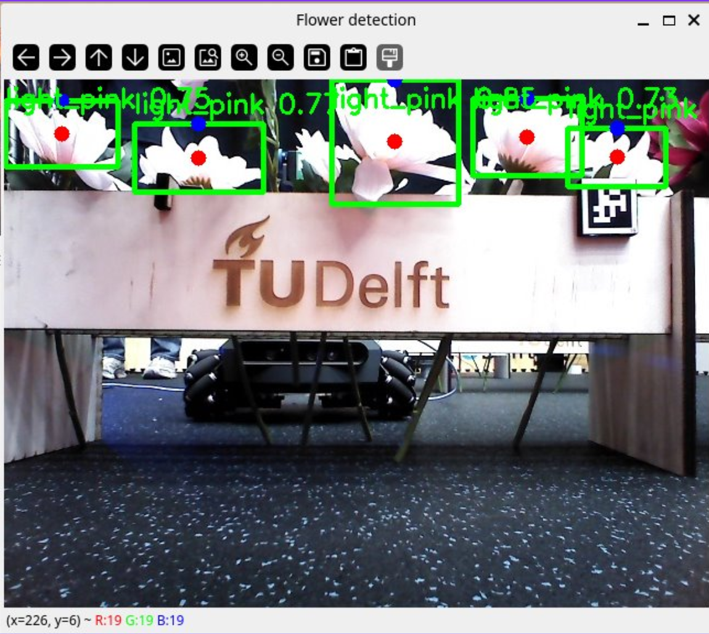
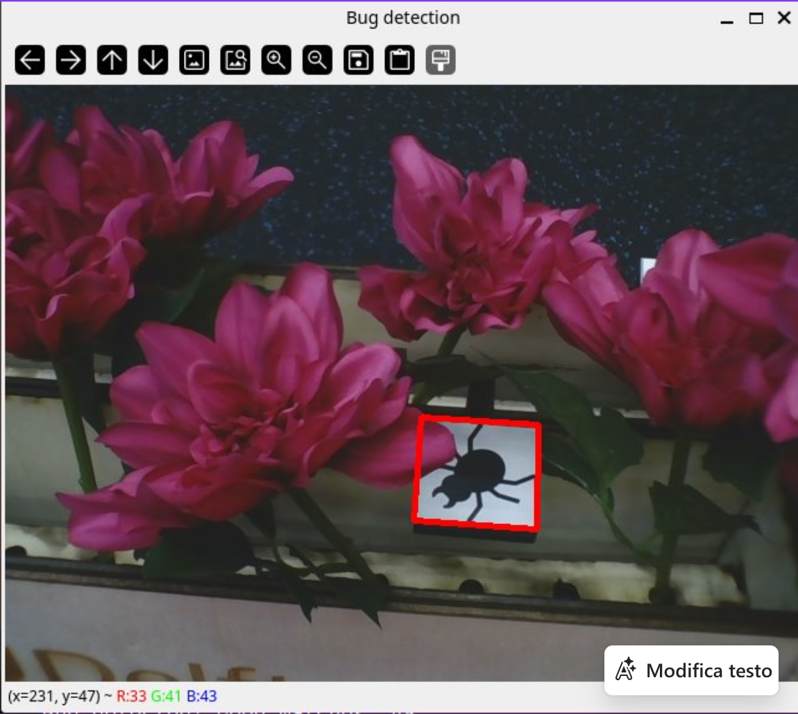
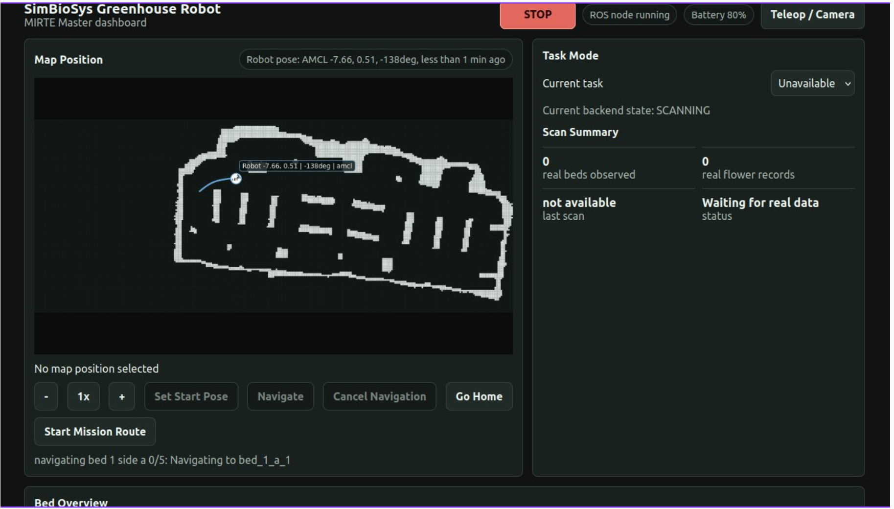
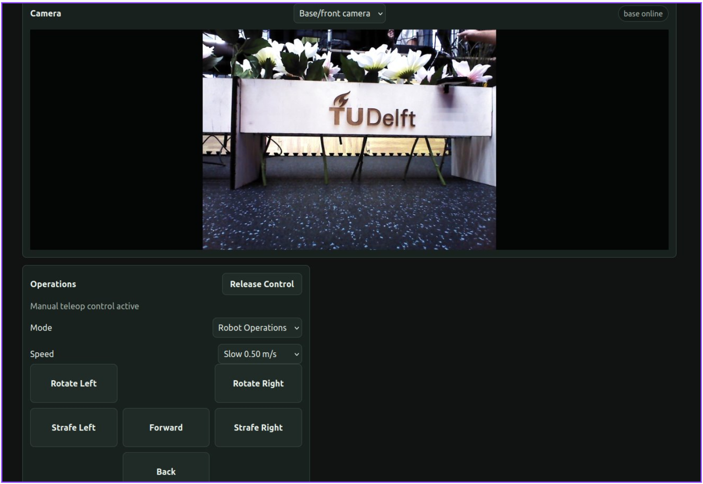
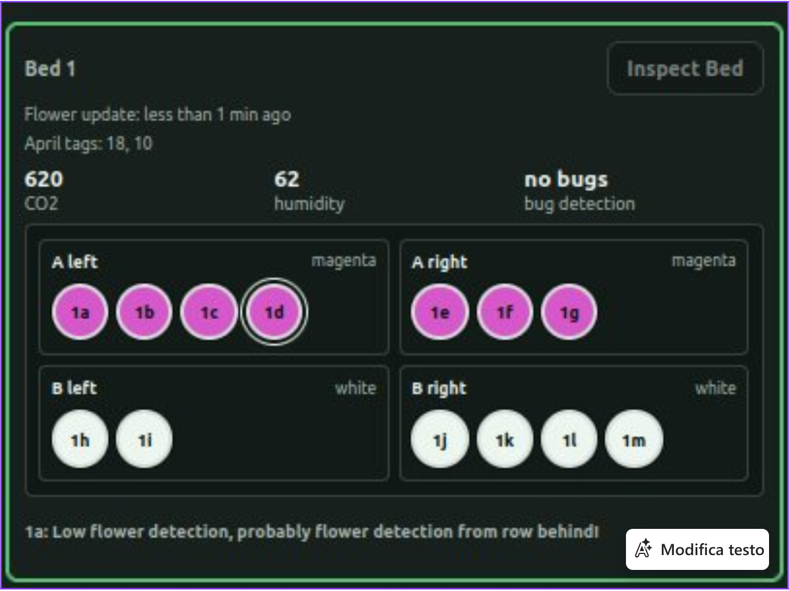
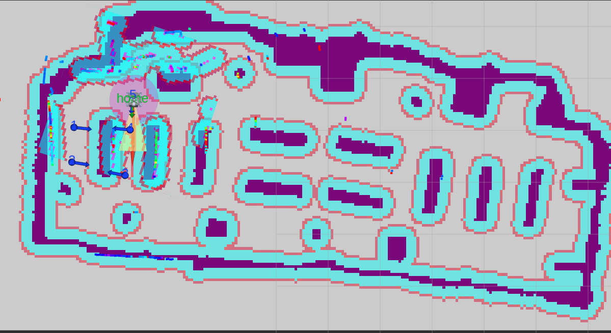

# SimBioSys: Autonomous Greenhouse Robot

ROS 2-based greenhouse robotics system for autonomous navigation, plant-health monitoring, operator interaction, and mobile manipulation on the MIRTE Master platform.

<table>
  <tr>
    <td align="center" width="50%">
      <video width="100%" controls muted loop playsinline>
        <source src="media/2x.mp4" type="video/mp4">
        <a href="media/2x.mp4">Open the robot navigation demo video.</a>
      </video>
      <br>
      <em>Robot navigation demo.</em>
    </td>
    <td align="center" width="50%">
      <video width="100%" controls muted loop playsinline>
        <source src="media/arm_2x.mp4" type="video/mp4">
        <a href="media/arm_2x.mp4">Open the flower picking demo video.</a>
      </video>
      <br>
      <em>Flower picking behavior demo.</em>
    </td>
  </tr>
</table>

---

## Contributors

**Group:** 6<br>
**Submission date:** 10/06/2026

<table>
  <tr>
    <td>

| Name              | Student Number |
|-------------------|----------------|
| Raaf ter Woerds   |    5368537     |
| Tommaso Calzolari |    6430600     |
| Olivier Boertje   |    5407346     |
| Luca Sackmann     |    6376754     |
| Mark Soldaat      |    5398118     |

  </td>
  <td align="center" style="vertical-align: middle; padding-left: 20px;">
    
    <br>
    <em>The MIRTE Master V2</em>
  </td>
  <td align="center" style="vertical-align: middle; padding-left: 20px;">
    
    <br>
    <em>SimBioSys team logo</em>
  </td>
  </tr>
</table>

---

## Overview

**SimBioSys** is an autonomous greenhouse robot developed for the TU Delft RO47007 Multidisciplinary Project. The system is designed to help monitor tulip beds by combining autonomous navigation, plant perception, digital-twin-style visualization, and operator supervision.

The robot is built around the **MIRTE Master** platform and follows a reuse-first ROS 2 architecture: instead of replacing existing robotics stacks, the system coordinates established tools such as **SLAM Toolbox**, **Nav2**, **AMCL**, **MoveIt2**, OpenCV, and the MIRTE hardware interfaces.

The project goal was to build a practical mobile robot prototype able to:

* navigate through a greenhouse environment;
* build and use maps for autonomous operation;
* inspect plant beds and collect plant-health information;
* display robot and plant data through a user interface;
* support teleoperation and operator feedback;
* prepare the system architecture for flower picking and harvesting behavior.

---

## Functional Flow

<p align="center">
  
  <br>
  <em>Functional flow of the SimBioSys greenhouse robot system.</em>
</p>

---

## Media

### Perception

<table>
  <tr>
    <td align="center">
      
      <br>
      <em>Perception output: flower detection.</em>
    </td>
    <td align="center">
      
      <br>
      <em>Bug detection.</em>
    </td>
  </tr>
</table>

### Operator UI

<table>
  <tr>
    <td align="center">
      
      <br>
      <em>Main operator dashboard overview.</em>
    </td>
    <td align="center">
      
      <br>
      <em>Teleoperation and live robot camera.</em>
    </td>
    <td align="center">
      
      <br>
      <em>Plant-bed status view.</em>
    </td>
  </tr>
</table>

---

## My Contribution: SLAM and Navigation

My main contribution focused on the **mapping, localization, and navigation stack** for the mobile base.

More specifically, I worked on:

* setting up and testing **SLAM Toolbox** for map creation;
* integrating saved maps with **Nav2 Map Server**;
* configuring localization with **AMCL**;
* validating the robot's odometry, LiDAR, and TF frames;
* testing autonomous navigation goals on the MIRTE platform;
* supporting the integration between mapping, navigation, and higher-level mission behavior;
* keeping the navigation stack compatible with both simulation and real-robot operation.

This work formed the basis for the robot's ability to move safely between greenhouse locations and approach plant beds for inspection.

<table>
  <tr>
    <td align="center">
      
      <br>
      <em>Generated SLAM map + localization + costmaps and checkpoints for navigation.</em>
    </td>
  </tr>
</table>

---

## System Architecture

The repository contains a modular ROS 2 workspace organized around project-specific `simbiosys_*` packages.

| Package                | Purpose                                                                          |
| ---------------------- | -------------------------------------------------------------------------------- |
| `simbiosys_interfaces` | Custom messages, services, and actions                                           |
| `simbiosys_behavior`   | Mission coordinator, behavior requests, status topics, and Nav2 goal wrapper     |
| `simbiosys_mapping`    | SLAM Toolbox configuration, mapping helpers, and map-related utilities           |
| `simbiosys_base`       | Base-motion and path-planning utilities                                          |
| `simbiosys_perception` | Flower, plant, and bug perception components                                     |
| `simbiosys_arm`        | Arm and gripper wrappers for MIRTE manipulation                                  |
| `simbiosys_ui`         | Operator interface and dummy dashboard mode                                      |
| `simbiosys_bringup`    | Launch files and configuration for simulation, UI, mapping, and real-robot modes |

---

## Setup

Install [Pixi](https://pixi.sh/latest/) if it is not already available.

Clone the repository:

```bash
git clone https://github.com/tommasocalzolari/simbiosys-greenhouse-robot.git
cd simbiosys-greenhouse-robot
```

Install the Pixi environment:

```bash
pixi install
```

Enter the Pixi shell:

```bash
pixi shell
```

Fetch the external MIRTE/ROS repositories listed in `repos.repos`:

```bash
pixi run vcs import --input repos.repos src
```

Ignore MIRTE packages that are not needed for this laptop-side workspace:

```bash
touch src/mirte-ros-packages/mirte_{bringup,telemetrix_cpp,teleop,test,zenoh_setup}/COLCON_IGNORE
```

Install dependencies and build:

```bash
rosdep install --from-paths src --ignore-src -r -y
colcon build
source install/setup.bash
```

Check that the custom interfaces are available:

```bash
ros2 interface show simbiosys_interfaces/srv/SendNamedArmPose
```

---

## Running the System

### Dummy UI Mode

Runs the terminal UI with fake dashboard data. Useful for development without the robot, Gazebo, Nav2, or cameras.

```bash
source install/setup.bash
ros2 launch simbiosys_bringup ui_system.launch.py
```

### Simulation Mode

Runs the MIRTE Master Gazebo simulation when the simulation packages are available.

```bash
source install/setup.bash
ros2 launch simbiosys_bringup simulation_mirte_master.launch.py
```

### Mapping Mode

Starts the mapping stack for building a map from LiDAR and odometry.

```bash
source install/setup.bash
ros2 launch simbiosys_bringup mapping_system.launch.py
```

### Teleoperation

Starts the teleoperation system.

```bash
source install/setup.bash
ros2 launch simbiosys_bringup teleop_system.launch.py
```

### Real Robot Laptop-Side Mode

Run the low-level MIRTE bringup on the robot first. Then, on the laptop:

```bash
source install/setup.bash
export ROS_DOMAIN_ID=1
export ROS_LOCALHOST_ONLY=0
ros2 launch simbiosys_bringup laptop_system.launch.py
```

Verify that the robot topics are visible:

```bash
ros2 topic list
ros2 topic echo /joint_states --once
ros2 topic echo /scan --once
ros2 topic echo /mirte_base_controller/odom --once
ros2 topic echo /camera/color/image_raw --once
```

Check the main TF frames:

```bash
ros2 run tf2_ros tf2_echo odom base_link
ros2 run tf2_ros tf2_echo base_link laser
ros2 run tf2_ros tf2_echo base_link camera_link
```

---

## Useful Launch Commands

```bash
# UI only
ros2 launch simbiosys_bringup ui_system.launch.py

# Teleoperation
ros2 launch simbiosys_bringup teleop_system.launch.py

# Mapping
ros2 launch simbiosys_bringup mapping_system.launch.py

# Real robot laptop-side system
ros2 launch simbiosys_bringup laptop_system.launch.py

# Arm wrapper test
ros2 launch simbiosys_bringup arm_test.launch.py
```

Safe named arm-pose service call:

```bash
ros2 service call /simbiosys/send_named_arm_pose simbiosys_interfaces/srv/SendNamedArmPose "{pose_name: home}"
```
